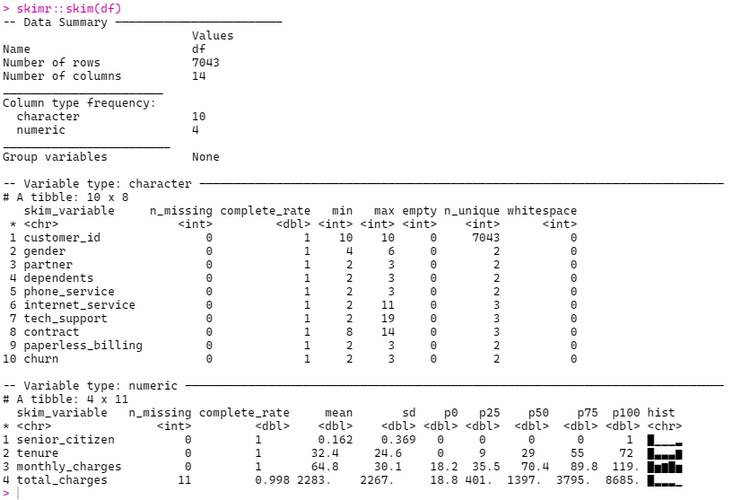

# Teste do Meli

<!-- badges: start -->

<!-- badges: end -->

## 1º Passo EDA

### Descrição do dataset



### Variaveis continuas

-   Geral

    Preciso aplicar algumas transformações

-   .by Churn

    Quando cruzamos com o churn, todas mostram influenciar o churn

    

### Variaveis categoricas

-   Geral

    

-   by Churn

    Genero e phone_service não tem impacto e podemos unir o contrato em duas categorias mensal e anual


### Transformações

```{r}
# Transformar:
df <- df %>% mutate(
    contract = if_else(contract == 'Month-to-month','Mensal','Anual')
   ,monthly_charges = log(monthly_charges)
   ,monthly_charges = if_else(monthly_charges <= 3.5, 0,1)
   ,fibra = if_else(internet_service == 'Fiber optic',1,0)
)
```

### Arvore de descição

Na arvore fica evididente quais são as variaveis mais importantes e assim treinar melhor o modelo.


### Random Forest
